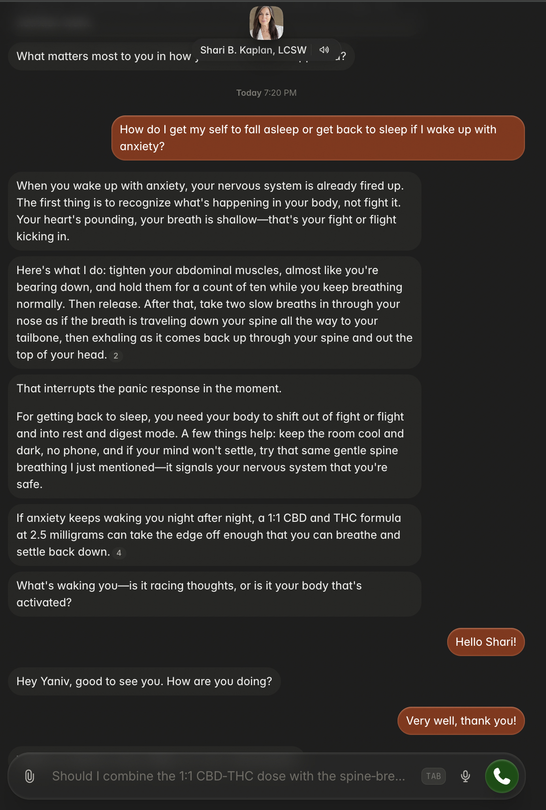
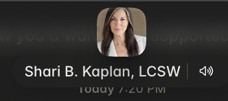
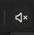
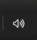
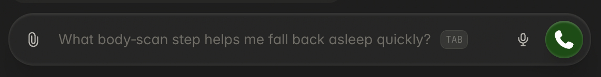
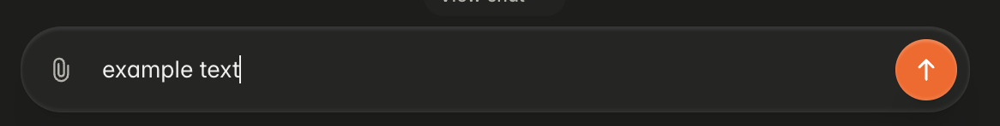

Purpose: Make the coach UI in Pencil look like it is an embedded version of Delphi.

we will make a sort of "light theme" version of Delphi (to match the existing UI):

this is the original:

note at the top the cenetered profile picture of Shari and her name + a "voice reading enabled" icon: 

clicking on the voice icon enables or disables the voice reading (of course, for now this does nothing).

disabled: 
enabled: 

clicking on the profile or on the name leads to a light theme version of the "shari overview screen":

to go back to the chat, click on the "see chat" icon at the bottom of the overview screen:

also note how the message box looks:

note that it looks different without text (note the suggestions), and with text:

